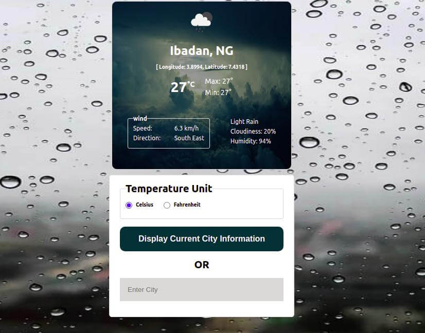

# Wheather App

> An App to retrieve and display weather information from the OpenWeatherMap API. Users' can choose to search Weather information by providing the name of the city or clicking on a button to use the current city they are in.



## Built With

- JavaScript
- HTML
- SCSS
- Webpack

## Live Demo

[Github Pages](https://chasscepts.github.io/weather-app/)

## Getting Started

To get a local copy up and running follow these simple example steps on the command line.

```bash

  # Clone the project from it's github repo.

  $ git clone https://github.com/chasscepts/weather-app

  # Change directory to the root of project

  $ cd weather-app

  # Install all dependencies

  $ npm install

  # Start webpack-dev-server (This will open the page in your browser)

  $ npm run serve

  # To build the project for production

  $ npm run build

```

## Authors

👤 **Obetta Francis**

[](https://github.com/chasscepts) [](https://twitter.com/chasscepts) [](https://www.linkedin.com/in/chasscepts/)

## 🤝 Contributing

Contributions, issues, and feature requests are welcome!

Feel free to check the [issues page](https://github.com/chasscepts/weather-app/issues).

## Show your support

Give a ⭐️ if you like this project!

## Acknowledgments

### Background Images

- drizzle by [Munro Studio](https://unsplash.com/@universaleye?utm_source=unsplash&utm_medium=referral&utm_content=creditCopyText) on [Unsplash](https://unsplash.com/s/photos/drizzle?utm_source=unsplash&utm_medium=referral&utm_content=creditCopyText)

- rain by [Anant Jain](https://unsplash.com/@anant90?utm_source=unsplash&utm_medium=referral&utm_content=creditCopyText) on [Unsplash](https://unsplash.com/s/photos/rain?utm_source=unsplash&utm_medium=referral&utm_content=creditCopyText)

- thunderstorm by [Florian Olivo](https://unsplash.com/@florianolv?utm_source=unsplash&utm_medium=referral&utm_content=creditCopyText) on [Unsplash](https://unsplash.com/s/photos/thunderstorms?utm_source=unsplash&utm_medium=referral&utm_content=creditCopyText)

- snow by [Wilfried Santer](https://unsplash.com/@wsanter?utm_source=unsplash&utm_medium=referral&utm_content=creditCopyText) on [Unsplash](https://unsplash.com/s/photos/snow?utm_source=unsplash&utm_medium=referral&utm_content=creditCopyText)

- clear [Tengyart](https://unsplash.com/@tengyart?utm_source=unsplash&utm_medium=referral&utm_content=creditCopyText) on [Unsplash](https://unsplash.com/s/photos/clear-sky?utm_source=unsplash&utm_medium=referral&utm_content=creditCopyText)

- clouds [Zbynek Burival](https://unsplash.com/@zburival?utm_source=unsplash&utm_medium=referral&utm_content=creditCopyText) on [Unsplash](https://unsplash.com/s/photos/clouds?utm_source=unsplash&utm_medium=referral&utm_content=creditCopyText)

- mist [Vjekoslav Domanović](https://unsplash.com/@vjeblackbirdlion?utm_source=unsplash&utm_medium=referral&utm_content=creditCopyText) on [Unsplash](https://unsplash.com/s/photos/mist?utm_source=unsplash&utm_medium=referral&utm_content=creditCopyText)

### Others

- Microverse Community
- Everyone whose code was used in this project

## 📝 License

This project is [MIT licensed](./LICENSE)
